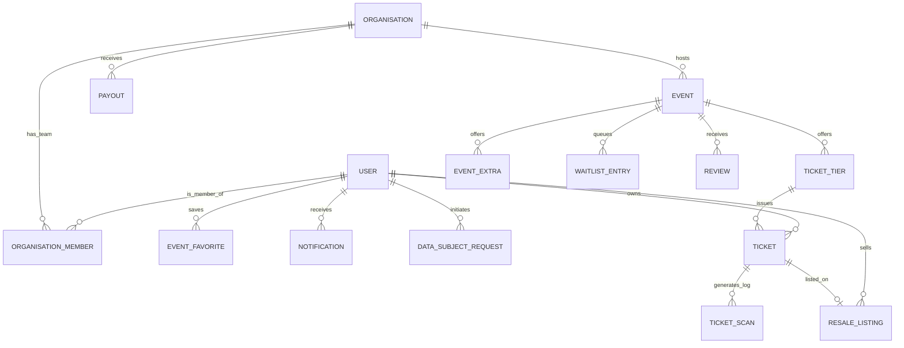

# Dunda App: Database Architecture & Production Schema

## 1. Critical Review & Rationale

The initial database schema served as a foundational model (a "reference implementation"), which made simplifying assumptions to bootstrap the application. The most critical simplification was collapsing the **Ticket Tier** concept into the **Event** itself (`ticket_tier_id == event.id`). While this allowed the inventory engine (`InventoryPoolServer`) to function, it fell short of the production requirements outlined in the UX/UI lifecycle map.

### Key Gaps Identified & Addressed

1.  **Multi-Tier Inventory**: Real-world events (and the in-progress `EventEditorLive` UI) require multiple ticket tiers (e.g., Early Bird, Regular, VIP) per event.
    *   *Solution*: Extracted inventory authority into the `ticket_tiers` table. The Redis inventory pool now maps to `inventory:<tier_id>` instead of `<event_id>`.
2.  **Upsells (Event Extras)**: Organisers sell parking, merchandise, or lockers alongside tickets.
    *   *Solution*: Added `event_extras` to model non-admission inventory.
3.  **Gate Entry & Auditing (Scans)**: The admission flow requires an immutable audit log to track successful check-ins, rejections, and duplicate attempts, preventing fraud and providing analytical insights.
    *   *Solution*: Created the append-only `ticket_scans` table. Added a partial unique index on `ticket_id` where `result = 'admitted'` to guarantee exactly-once admission at the database level.
4.  **Engagement & Retention**: The UX map includes "Waitlist" flows, "Past Events" reviews, "Favoriting" events, and a notifications hub.
    *   *Solution*: Introduced `waitlist_entries` (FIFO queued demand), `reviews`, `event_favorites`, and `notifications`.
5.  **Organiser Lifecycle & Payouts**: The Organiser Portal supports onboarding (KYC), team RBAC, and B2C M-Pesa settlements.
    *   *Solution*: Enriched `organisations` with KYC status/branding, added `organisation_members` for RBAC (e.g., `scanner` role for gate devices), and built the `payouts` ledger.
6.  **Compliance & Data Privacy**: Kenya Data Protection Act (ODPC) compliance requires auditable Data Subject Requests.
    *   *Solution*: Added `data_subject_requests` to track access/erasure requests with statutory SLAs.
7.  **Resale Market Safeguards**: Anti-scalping policies cap resale asking prices at face value.
    *   *Solution*: Extended `resale_listings` with `face_value_kes` and added a Postgres `CHECK` constraint (`asking_price_kes <= face_value_kes`). Added `buyer_id` and `sold_at` for settlement.

## 2. Platform Lifecycle Mapping

The database now maps 1:1 with the defined Dunda App lifecycles:

### A. The Organiser Lifecycle
1.  **Onboarding**: User creates an `Organisation`. State is `pending` until KYC approval (`verification_status = 'verified'`).
2.  **Team Building**: Owner invites `OrganisationMember`s with specific roles (`admin`, `manager`, `scanner`).
3.  **Creation**: Organiser publishes an `Event`, configuring `TicketTier`s and `EventExtra`s.
4.  **Settlement**: Ticket sales accumulate in escrow. The `PayoutWorker` initiates Daraja B2C transfers, logging idempotent `Payout` records.

### B. The Attendee Lifecycle
1.  **Discovery**: Feeds query `events` based on `status = 'published'`, geo-proximity (`latitude`, `longitude`), and category. Users save `EventFavorite`s.
2.  **Purchase**: Users buy `Ticket`s (linked to `TicketTier`s).
3.  **Waitlist**: If a tier is sold out, users join `WaitlistEntry`. When inventory frees up, the oldest `queued` entry is `offered`.
4.  **Admission**: Gate staff (role: `scanner`) scan QR codes. `TicketScan` records the result. `Ticket` is marked `checked_in_at`.
5.  **Post-Event**: Attendees leave `Review`s.
6.  **Resale**: Users can list tickets on the secondary market via `ResaleListing`, strictly capped at `face_value_kes`.

## 3. Entity-Relationship Diagram (ERD)

## 4. Integrity and Defence in Depth

The production schema relies heavily on database-level constraints to guarantee state consistency, shielding the app from race conditions:

*   **Financials**: `CHECK (price_cents >= 0)` and `CHECK (asking_price_kes <= face_value_kes)`.
*   **Exactly-Once Processing**:
    *   Partial unique index on `ticket_scans` (`result = 'admitted'`).
    *   Unique index on `payouts.b2c_conversation_id` for Daraja idempotency.
*   **State Machines**: `CHECK (status IN (...))` on all lifecycle enums (events, waitlists, payouts, DSRs, resale).
*   **Orphan Prevention**: Strategic use of `ON DELETE CASCADE` (e.g., deleting an event deletes its tiers and extras) vs. `ON DELETE NILIFY` (e.g., deleting a user nullifies `transferred_from_user_id` on tickets to preserve the audit trail).

## 5. Phase 4 release-governance ledger

The `release_approvals` table is an append-oriented control-plane ledger, not
application business data. Each guarded feature requires independent
`security`, `finance`, and `operations` approvals with distinct approver
references, evidence, expiry, and canary scope. Revocation is represented by
`revoked_at`; historical rows are retained for audit and renewal creates a new
row rather than mutating evidence. The application evaluates only rows that
are current, non-revoked, and within their validity interval, and denies on
database or configuration failure.

## 6. Phase 6 settlement, resale, refunds, and payout authority

Phase 6 adds durable `refunds`, `payout_batches`, and `payout_items` records;
extends orders with `kind`, resale linkage, and refund state; and records ticket
supersession/revocation provenance. A partial unique index permits at most one
active listing per ticket, while immutable face value and database checks cap
the asking price. Payout item selection uses `FOR UPDATE SKIP LOCKED` and a
unique order constraint, so one payable order cannot enter two batches.

Payout destinations are encrypted columns. The migration intentionally aborts
when legacy plaintext destinations exist; an audited vault backfill must occur
before the schema hardening can be applied. Provider submission is first claimed
as `submitting`; acceptance records `submitted`; only a verified final result
records `paid`. Refunds revoke tickets
before any future inventory-restock reconciliation and preserve all historical
state transitions.

## 7. Phases 3–5 checkout and settlement authority

The additive authority model consists of `quotes`, `payment_intents`,
`payment_attempts`, `provider_events`, `inventory_pools`,
`inventory_reservations`, `payment_line_items`, `ticket_batches`,
`payment_intent_transitions`, and `outbox_events`. PostgreSQL row locks and the
`capacity - reserved - sold >= quantity` conditional update enforce reservation
safety; Redis is reconstructed as a disposable projection.

`journal_transactions` and `journal_lines` are append-only, with deferred
PostgreSQL balance triggers. `accounts` and `account_balances` support the
projection and reporting layer but are not the financial authority. Provider
receipts and checkout identifiers are unique, and provider events are
deduplicated before reconciliation.
